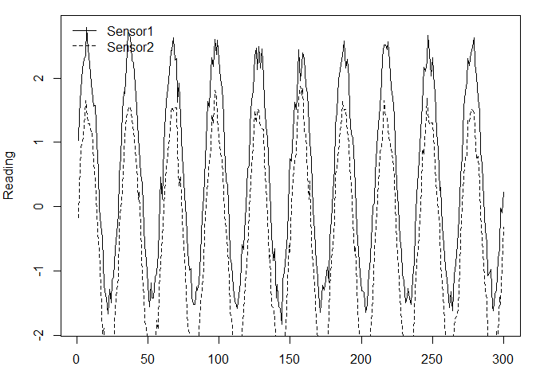

<!-- README.md is generated from README.Rmd. Please edit that file -->

# synthsensor

<!-- badges: start -->

[](https://github.com/AstridMarie2/synthsensor/actions/workflows/R-CMD-check.yaml)
<!-- badges: end -->

**synthsensor** generates **labeled, two-sensor synthetic time series**
for benchmarking sensor diagnostics and uncertainty methods. It supports
configurable background signals (AR(1), random walk, Poisson moving
average, sine), **delay/attenuation**, **noise & bias, spikes**
(correlated/uncorrelated), and **drifts**, and outputs per-timestep
**anomaly flags** and **true error** proxies.

- Reproducible datasets for detection/diagnostics research
- Scriptable functions **and** an interactive Shiny app
- Labeled outputs for supervised and rule-based evaluation

## Installation

Development version from GitHub:

``` r
# install.packages("remotes")
remotes::install_github("AstridMarie2/synthsensor")
```

Or work from source during development:

``` r
# install.packages("remotes")
devtools::load_all(".")
```

## Anomaly flags

AnomalyFlag1/2 are factors with levels: Normal, Drift, Spike, Both,
SpikeCorr **Overlap rule**: any Drift overlapping with Spike or
SpikeCorr is labeled Both. **Correlation**: windows injected as
“correlated spikes” are flagged SpikeCorr on both sensors.

## Minimal example

Generate a short dataset with a sine background, Gaussian noise, and a
few uncorrelated spikes:

``` r
library(synthsensor)

df <- generate_data_function(
  n = 300,
  add_background   = TRUE,
  background_type  = "Sine Wave",
  sine_amplitude   = 2,
  sine_period      = 30,
  sd1 = 0.15, sd2 = 0.15,
  crosscor_noise   = 0,
  mean1 = 0.5, mean2 = -0.5,
  # anomalies
  n_spikes_corr    = 0,
  n_spikes_s1      = 3,
  n_spikes_s2      = 2,
  max_spike_length = 6,
  n_drifts_s1      = 1,
  n_drifts_s2      = 0,
  drift_duration   = c(25, 35),
  drift_slope      = c(0.05, 0.08),
  delayed_sensor   = "None",
  alpha_ema        = 0.3
)

head(df)
#>   TimeSinceClean  Sensor1    Sensor2                Date AnomalyFlag1 AnomalyFlag2 Measurand1  Measurand2      Diff
#> 1              1 1.024476 -0.1734142 2025-01-01 00:00:00       Normal       Normal  0.9158234 -0.08417662 1.1978903
#> 2              2 1.427743  0.2737805 2025-01-01 01:00:00       Normal       Normal  1.3134733  0.31347329 1.1539626
#> 3              3 1.817718  0.9042105 2025-01-01 02:00:00       Normal       Normal  1.6755705  0.67557050 0.9135072
#> 4              4 2.145533  0.9916997 2025-01-01 03:00:00       Normal       Normal  1.9862897  0.98628965 1.1538333
#> 5              5 2.298991  1.2462778 2025-01-01 04:00:00       Normal       Normal  2.2320508  1.23205081 1.0527134
#> 6              6 2.353803  1.6542066 2025-01-01 05:00:00       Normal       Normal  2.4021130  1.40211303 0.6995960
```

Quick look at the series and labels:

``` r
oldpar <- par(no.readonly = TRUE); on.exit(par(oldpar))
par(mar = c(3,4,1,1))
plot(df$TimeSinceClean, df$Sensor1, type = "l", xlab = "t", ylab = "Reading")
lines(df$TimeSinceClean, df$Sensor2, lty = 2)
legend("topleft", legend = c("Sensor1","Sensor2"), lty = c(1,2), bty = "n")
```



``` r

table(Anom1 = df$AnomalyFlag1)
#> Anom1
#>    Normal     Drift     Spike      Both SpikeCorr 
#>       265        24         3         8         0
table(Anom2 = df$AnomalyFlag2)
#> Anom2
#>    Normal     Drift     Spike      Both SpikeCorr 
#>       291         0         9         0         0
```

# Shiny app

Launch the interactive app:

``` r
# synthsensor::app_synth()
```

The app lets you configure parameters, visualize results, and export CSV
with labels.

# Testing

Run the automated tests:

``` r
devtools::test()
#> i Testing synthsensor
#> v | F W  S  OK | Context
#> / |          0 | generate_background_function                                                                         / |         16 | generate_background_function                                                                         v |         19 | generate_background_function
#> / |          0 | generate_data_function                                                                               | |          7 | generate_data_function                                                                               v |         18 | generate_data_function
#> 
#> == Results ===========================================================================================================
#> [ FAIL 0 | WARN 0 | SKIP 0 | PASS 37 ]
```

Continuous Integration runs R CMD check and tests on pushes/PRs (see the
badge above).

# Citation

If you use **synthsensor** in research, please cite the software (Zenodo
DOI) and the JOSS paper (once available).

# Licence

MIT (C) Astrid Marie Skålvik
