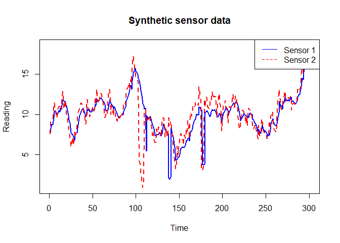

<!-- README.md is generated from README.Rmd. Please edit that file -->

# synthsensor

<!-- badges: start -->

[](https://github.com/AstridMarie2/synthsensor/actions/workflows/R-CMD-check.yaml)
<!-- badges: end -->

**synthsensor** generates **labeled, two-sensor synthetic time series**
for benchmarking sensor diagnostics and uncertainty methods. It supports
configurable background signals (AR(1), random walk, Poisson moving
average, sine), **delay/attenuation**, **noise & bias, spikes**
(correlated/uncorrelated), and **drifts**, and outputs per-timestep
**anomaly flags** and **true error** proxies.

- Reproducible datasets for detection/diagnostics research
- Scriptable functions **and** an interactive Shiny app
- Labeled outputs for supervised and rule-based evaluation

## Installation

Development version from GitHub:

``` r
# install.packages("remotes")
remotes::install_github("AstridMarie2/synthsensor")
```

Or work from source during development:

``` r
# install.packages("remotes")
devtools::load_all(".")
```

## Anomaly flags

AnomalyFlag1/2 are factors with levels: Normal, Drift, Spike, Both,
SpikeCorr **Overlap rule**: any Drift overlapping with Spike or
SpikeCorr is labeled Both. **Correlation**: windows injected as
“correlated spikes” are flagged SpikeCorr on both sensors.

## Minimal example

Generate a short dataset with a AR(1) background, Gaussian noise, delay
and attenuation for sensor1, a drifting period in sensor 2, and a few
uncorrelated spikes for both sensors:

``` r
library(synthsensor)

df <- generate_data_function(
    n = 300,
    # Background signal
    add_background   = TRUE,
    background_type  = "AR(1) Process", # Select between "Poisson Moving Average", "Random Walk", "Sine Wave", "AR(1) Process" and 
    background_phi = 0.97, # Autocorrelation (in time)
    background_rho = 1, # Correlation between sensors
    # Noise parameters
    sd1 = 0.15, sd2 = 0.15,
    crosscor_noise   = 0,
    mean1 = 10, mean2 = 10,
    # Anomalies
    n_spikes_corr    = 0,
    n_spikes_s1      = 3,
    n_spikes_s2      = 2,
    max_spike_length = 6,
    n_drifts_s1      = 0,
    n_drifts_s2      = 1,
    drift_duration   = c(75, 100), # Drift duration range
    drift_slope      = c(1, 2), # Drift slope range
    # Delay
    delayed_sensor   = "Sensor1", # "None", "Sensor1" or "Sensor2"
    alpha_ema        = 0.3 # For selected delayed sensor
)

head(df)
#>   Time   Sensor1   Sensor2                Date AnomalyFlag1 AnomalyFlag2 Measurand1 Measurand2       Diff
#> 1    1  7.700060  7.579347 2025-01-01 00:00:00       Normal       Normal   7.694511   7.694511  0.1207133
#> 2    2  8.189320  9.179342 2025-01-01 01:00:00       Normal       Normal   9.322384   9.322384 -0.9900228
#> 3    3  8.780835  9.253083 2025-01-01 02:00:00       Normal       Normal   9.413221   9.413221 -0.4722485
#> 4    4  8.737307  9.492277 2025-01-01 03:00:00       Normal       Normal   9.560112   9.560112 -0.7549702
#> 5    5  9.617662 11.335790 2025-01-01 04:00:00       Normal       Normal  11.288374  11.288374 -1.7181279
#> 6    6 10.322373 11.406246 2025-01-01 05:00:00       Normal       Normal  11.710639  11.710639 -1.0838729
```

Quick look at the series and labels:

``` r
plot(df$Time, df$Sensor1, type = "l", col = "blue", lwd = 2, ylim = range(c(df$Sensor1, df$Sensor2)),
         main = "Synthetic sensor data",
         ylab = "Reading", xlab = "Time", lty = 1)
    lines(df$Sensor2, col = "red", lwd = 2, lty = 2)
    legend("topright", legend = c("Sensor 1", "Sensor 2"), col = c("blue", "red"), lty = c(1,2))
```



``` r
    
table(Anom1 = df$AnomalyFlag1)
#> Anom1
#>    Normal     Drift     Spike      Both SpikeCorr 
#>       293         0         7         0         0
table(Anom2 = df$AnomalyFlag2)
#> Anom2
#>    Normal     Drift     Spike      Both SpikeCorr 
#>       214        77         6         3         0
```

# Shiny app

Launch the interactive shiny app:

``` r
# synthsensor::app_synth()
```

The app lets you configure parameters, visualize results, and export CSV
with labels.

# Testing

Run the automated tests:

``` r
devtools::test()
#> i Testing synthsensor
#> v | F W  S  OK | Context
#> / |          0 | generate_background_function                                                                                                    \ |          6 | generate_background_function                                                                                                    / |         12 | generate_background_function                                                                                                    \ |         18 | generate_background_function                                                                                                    v |         19 | generate_background_function
#> / |          0 | generate_data_function                                                                                                          - |          5 | generate_data_function                                                                                                          | |          7 | generate_data_function                                                                                                          | |         11 | generate_data_function                                                                                                          \ |         14 | generate_data_function                                                                                                          \ |         18 | generate_data_function                                                                                                          v |         18 | generate_data_function
#> 
#> == Results ======================================================================================================================================
#> Duration: 1.4 s
#> 
#> [ FAIL 0 | WARN 0 | SKIP 0 | PASS 37 ]
```

Continuous Integration runs R CMD check and tests on pushes/PRs (see the
badge above).

# Citation

If you use **synthsensor** in research, please cite the software (Zenodo
DOI) and the JOSS paper (once available).

# Licence

MIT (C) Astrid Marie Skålvik
